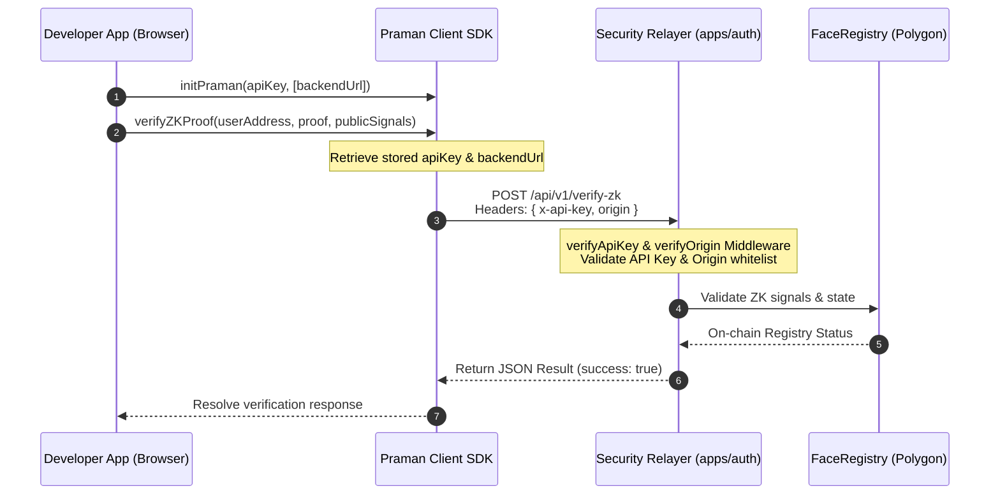

# PramanNetwork Authentication Workspace

**Status:** 🧪 Beta | **Ecosystem Network:** Polygon Amoy (Testnet)

PramanAuth is a **Web2.5 Hybrid Relayer (BaaS)** platform offering gasless, privacy-preserving zero-knowledge (ZK) biometric authentication. It enables trustless identity validation on client applications with **zero gas fees for end-users, no browser wallet popups, and secure backend-managed keys.**

---

## Monorepo Workspace Overview

This repository is managed as a Turborepo monorepo:

*   **[`packages/sdk`](file:///Users/rahulchaudhary/pramanauth/packages/sdk)**: Client Interface SDK. Handles local biometric scanning, liveness detection, and client-side ZK-Proof generation.
*   **[`apps/web`](file:///Users/rahulchaudhary/apps/web)**: Developer Dashboard managing API Keys, Origin Whitelists, and integration usage analytics. (Referred to as `apps/identity-provider` in staging/sandbox deployments).
*   **[`apps/auth`](file:///Users/rahulchaudhary/pramannetworkhome/apps/auth)**: Security Relayer service. Express backend microservice running on port `5050` that handles Pinata IPFS uploads, pays transaction gas on Polygon Amoy, and verifies ZK proofs off-chain.
*   **[`circuits`](file:///Users/rahulchaudhary/pramanauth/circuits)**: Circom zero-knowledge matching circuits (`face_verify.circom`).
*   **[`contracts`](file:///Users/rahulchaudhary/pramanauth/contracts)**: Solidity smart contracts (`FaceRegistry.sol`).

---

## Monorepo Setup & Local Contribution

### Prerequisites
Make sure Node.js (v18+) and npm are installed globally.

### Setup and Build Workflow

**1. Install all dependencies across the monorepo:**
```bash
npm install
```

**2. Build all packages and applications in the monorepo concurrently (Turborepo):**
```bash
npm run build
```

**3. Run the development environment (starts all services):**
```bash
npm run dev
```

---

## SDK Integration Guide

### Installation

Install the SDK package and `tslib` (peer dependency for helper resolution) in your frontend application:

```bash
npm install @praman-network/sdk tslib
```

### Setup with Vite (React / Vue)
Vite requires polyfills to resolve Node.js variables:

**1. Install the polyfill plugin:**
```bash
npm install vite-plugin-node-polyfills --save-dev
```

**2. Update `vite.config.ts`:**
```javascript
import { defineConfig } from 'vite';
import react from '@vitejs/plugin-react';
import { nodePolyfills } from 'vite-plugin-node-polyfills';

export default defineConfig({
  plugins: [
    react(),
    nodePolyfills({
      globals: {
        Buffer: true,
        global: true,
        process: true,
      },
    }),
  ],
});
```

### SDK Initialization

Initialize the SDK singleton.

#### Option 1: Simple Initialization (Production Defaults)
Suitable for live integrations pointing to the production relayer (`https://api.praman.network`):

```typescript
import { initPraman } from '@praman-network/sdk';

const praman = initPraman("pm_live_your_api_key");
```

#### Option 2: Custom Configuration (Testing/Sandbox)
Configure options for local development connecting to the `apps/auth` backend service (running on port `5050`):

```typescript
import { initPraman } from '@praman-network/sdk';

const praman = initPraman({
  apiKey: "pm_dev_your_api_key",
  network: "polygon-amoy",
  backendUrl: "http://localhost:5050", // Custom microservice URL
  livenessLevel: "standard"
});
```

---

## Framework Support

The SDK supports various architectural setups:

### 1. Next.js (App Router)
For Next.js implementations, restrict components interacting with the SDK to client boundaries using `'use client'`:

```typescript
'use client';

import React from 'react';
import { initPraman } from '@praman-network/sdk';

const praman = initPraman(
  process.env.NEXT_PUBLIC_PRAMAN_API_KEY || '',
  process.env.NEXT_PUBLIC_PRAMAN_BACKEND_URL
);

export default function LoginPage() {
  return <button onClick={() => praman.loginWithPopup()}>Authenticate</button>;
}
```

### 2. Generic Single Page Apps (SPA) / Vanilla JS
Import from the CommonJS or ES build module directly:

```javascript
import { initPraman, verifyZKProof } from '@praman-network/sdk';

initPraman("pm_dev_key", "http://localhost:5050");

async function handleVerification(address, proof, signals) {
  const response = await verifyZKProof(address, proof, signals);
  if (response.success) {
    console.log("Verified successfully!");
  }
}
```

---

## Security Architecture ("Security First")

PramanAuth implements a multi-tier security architecture to protect verification channels from sybil and spoofing exploits:

1.  **API Key Validation (`x-api-key`):** The client SDK passes the API Key in the headers on all API requests. The relayer compares the key against active records in our metadata registry.
2.  **Origin Whitelisting:** The relayer validates incoming headers (`origin` and `referer`) against allowed domains. Unrecognized request origins are blocked to prevent unauthorized reuse of API keys.
3.  **Rate Limiting:** The relayer implements rate-limiting policies to prevent brute-force proving submissions and denial of service.



---

## Verification & Production Hardening

### Environment Guard
The SDK contains an automated **Environment Guard** that monitors execution modes.

> [!WARNING]
> **Environment Strict Mode:** In production builds (`process.env.NODE_ENV === 'production'` or `import.meta.env.MODE === 'production'`), the SDK enforces a strict, hard-fail security policy. If ZK proof generation fails due to browser memory limits, asset delivery problems, or system timeouts, authentication fails immediately. Mock proofs are strictly rejected in production.

### Backend Token Filtering
When integrating PramanAuth within your own server backend, always inspect and filter claims:

> [!IMPORTANT]
> **Mock Token Filter:** Always check the `is_mock` flag in the decoded JWT payload on your backend. If `is_mock: true` is detected in a production build, your backend **must** reject the authentication session immediately to prevent mock-bypass exploits.

---

## Zero-Knowledge Privacy & Sovereignty

*   **Zero Biometric Storage:** PramanAuth does not store raw biometric data (such as photos, video feeds, or raw face descriptors) on any centralized server.
*   **Decentralized Verification:** 128-dimensional quantized face vectors are Keccak256 hashed. Comparisons are computed locally inside the user's browser using Groth16 SnarkJS provers.
*   **Decentralized Identity:** Trust is mathematically guaranteed without revealing user biometric templates.
